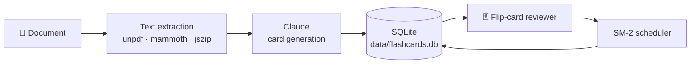

<div align="center">

# 🧠 BrainDeck

### Turn any document into flashcards that stick.

Drop in a PDF, Word document or PowerPoint. Claude writes the questions.
An SM-2 spaced repetition schedule decides when you see each card again.


<!-- Replace with your own screenshot: docs/screenshots/hero.png -->


</div>

---

## What it does

- **📄 Reads your real study material** — PDF, Word `.docx`, PowerPoint `.pptx`, `.txt` and `.md`
- **🤖 Writes the cards for you** — Claude turns the document into one-fact-per-card Q&A pairs, following established card-design rules
- **🔁 Schedules them properly** — an independent TypeScript implementation of the SM-2 algorithm, with learning steps, ease factors, lapses and interval fuzz
- **📚 Remembers everything** — a permanent library of every document you have uploaded and every deck it produced
- **📊 Tracks your progress** — retention rate, daily workload and a 14-day review history

---

## Quick start

You need [Node.js 18 or newer](https://nodejs.org) and an [Anthropic API key](https://console.anthropic.com).

```bash
npm install
cp .env.local.example .env.local   # then paste your API key into .env.local
npm run dev
```

Open **http://localhost:3000** and drop in a document.

---

## How it works



1. The file is parsed **on your machine** — only the extracted text is sent to Claude.
2. Claude returns strict JSON: a deck title, a summary, and the cards.
3. Everything is written to one SQLite file in a single transaction.
4. Study mode serves only the cards that are due, newest cards last.
5. Grading a card runs the scheduler and appends to an immutable review log.

---

## Project structure

```
src/
├── app/
│   ├── page.tsx          Upload screen
│   ├── library/          Deck list + searchable card browser
│   ├── study/[id]/       The flip-card reviewer
│   ├── stats/            Progress dashboard
│   └── api/              generate · decks · study · review · stats
├── components/Nav.tsx
└── lib/
    ├── ai.ts             Prompt engineering + Claude call
    ├── db.ts             Schema and queries
    ├── extract.ts        PDF / DOCX / PPTX parsing
    └── scheduler.ts      The SM-2 spaced repetition algorithm
```

---

## Testing the algorithm

The scheduler has no dependencies, so its test harness runs without installing anything:

```bash
node --experimental-strip-types scripts/test-scheduler.ts
```

27 assertions covering every state transition, the safety rails (ease floor, interval cap) and a
30-day study simulation.

---

## Configuration

Everything lives in `.env.local`:

| Variable | Default | What it does |
| --- | --- | --- |
| `ANTHROPIC_API_KEY` | — | Your key from console.anthropic.com |
| `ANTHROPIC_MODEL` | `claude-sonnet-5` | Use `claude-haiku-4-5-20251001` for cheaper, faster generation |
| `CARDS_PER_DOCUMENT` | `25` | Roughly how many cards to aim for |

To change how aggressively the app schedules you, edit `CONFIG` at the top of
`src/lib/scheduler.ts` — learning steps, graduating interval, ease bonus and the interval cap are
all in one object.

To change the look, edit the `:root` colour variables at the top of `src/app/globals.css`.

---

## Screenshots

| Upload | Study | Library |
| --- | --- | --- |
|  |  |  |

---

## Project report

`docs/generate_project_report.py` builds a full Word document explaining the architecture, the
scheduling strategy and the cognitive science behind spaced repetition:

```bash
pip3 install python-docx
python3 docs/generate_project_report.py
```

---

## Credits and licensing

The spaced repetition scheduler is an **independent reimplementation** of the documented SM-2
behaviour used by [Anki](https://github.com/ankitects/anki) — no Anki source code is included in
this repository. Anki is licensed **AGPL-3.0-or-later**; algorithms themselves are not
copyrightable, which is why this project can carry its own licence. Anki's influence is credited in
the source comments where it applies.

Built with [Next.js](https://nextjs.org), [Claude](https://claude.com) and
[better-sqlite3](https://github.com/WiseLibs/better-sqlite3).

---

<div align="center">
<sub>Made for students who would rather revise than type.</sub>
</div>
